!!!configuration "Feature in preview"
    This feature is only available on beta builds
    
    
SOCA lets you deploy Windows and/or Linux desktops using [NICE DCV](https://aws.amazon.com/hpc/dcv/) technology. To get started, select either "Linux Desktop" or "Windows Desktop" in the left sidebar.

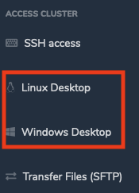

## Create your Windows/Linux desktop

To launch your Windows/Linux desktop, you first have to pick a name, choose how much storage you want to allocate as well as specify other options such as hibernation support, compute type, software stack or even subnet id.

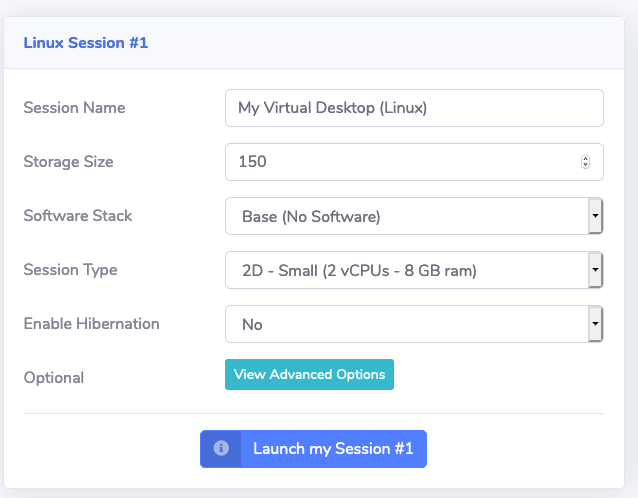

!!!info "Need help?"
    Hover your mouse on the parameter name to display help section.
    
    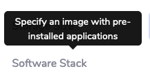
    
Once you are ready, click "Launch My Session" button. Your session interface will be changed to pending state.

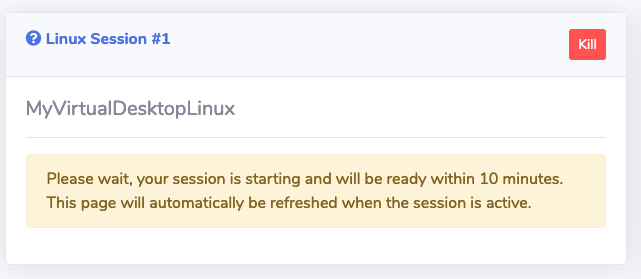

Your virtual desktop will be ready within 10-15 minutes. Startup time is based on the image selected, the operating system as well as the instance type. Windows tends to boot faster as some components such as the scheduler or EFS are not installed.

!!!info "Nvidia drivers for GPU instances"
    SOCA automatically install Nvidia GRID (G3/G4) drivers. Tesla drivers (P3) have to be installed separately by the customers.

Once your virtual desktop is active, your session interface will display two ways to connect to it:

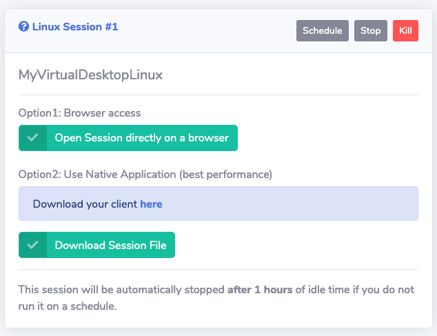

You can either access your desktop directly via your browser (Option1) or use the NICE DCV native application (Option2). A link to download the application is provided on the website. For better performance, we recommend using the Option 2.

### Example of Linux desktop

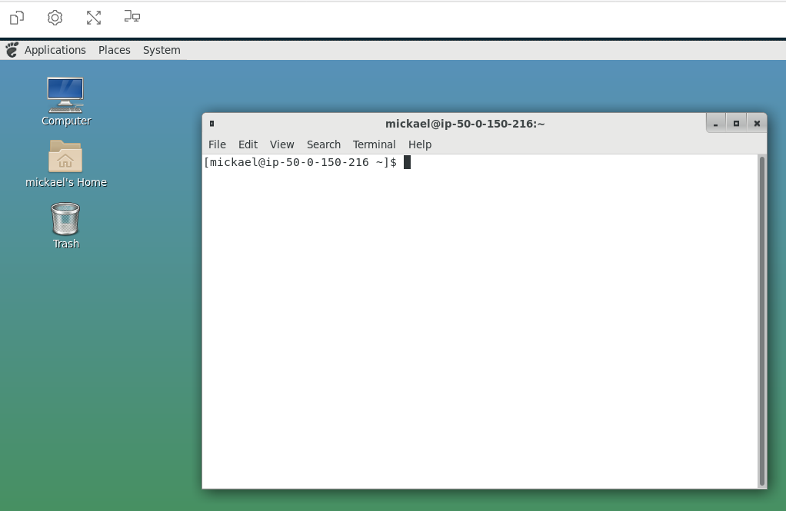

### Example of Windows desktop

!!!danger "Important"
    Unlike Linux desktops, Windows desktops are not connected to the scheduler and you cannot submit jobs directly from your Windows system.
    
    To submit a job via Windows, [you first need to access the web ui then submit a job via HTTP endpoint](../../web-interface/submit-hpc-jobs-web-based-interface/#submit-a-test-job) or [via the HTTP REST API](../../web-interface/control-hpc-job-with-http-web-rest-api/)

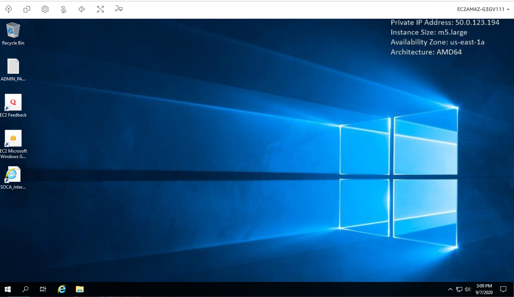

## Stop/Hibernate your desktop

!!!info "What does hibernate means?"
    When you hibernate an instance, your desktop state is saved in memory. When you restart it, all your applications will automatically resume. On the other hand, stopping a virtual desktop is the same as powering off your laptop. Note not all EC2 instances support hibernation.

To stop/hibernate your session, click the "Stop" (or "Hibernate") button in the top bar.


A popup will appear, asking you to confirm your action. Click "Stop/Hibernate my session" button to temporarily turn off your virtual desktop.


Your desktop is now stopped (you are not charged for compute price while your instance is stopped). To restart your session simply click "Restart your session" button.

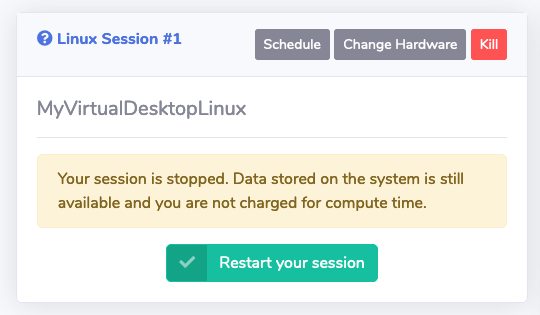

## Configure your desktop auto start/stop time

To change the schedule of your desktop, click the "Schedule" button in the top bar.


SOCA will honors your session schedule and automatically start/stop your desktop based on your own schedule.
Desktop will be stopped outside of scheduled hours only if they are idle.
You can configure three type of schedule for your desktop:

 - Run all day (SOCA will ensures your desktop is up and running from 12 AM to 12 PM)
 - Stopped all day (SOCA will ensures your desktop is stopped from 12 AM to 12 PM)
 - Custom schedule (SOCA will honors your own schedule)

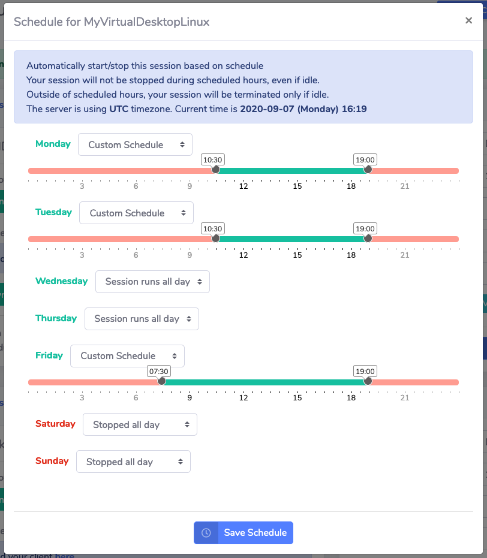

!!!info 
    If you manually start your desktop during off hours, your session will be up and running until it becomes idle. Idle time can be customized by cluster admins.
    
!!!danger "Schedule and Timezone"
    By default, SOCA is configured to use UTC timezone and this may be a problem if you are currently using a different timezone. To fix that, you can adjust your local timezone on `config.py` (then restart the web ui)

## Update your hardware requirements on the fly

You can upgrade/downgrade the hardware of your desktop only when your session is stopped and if you have disabled hibernation.
To do so, click 


Choose the new type of instance you want to resize your desktop to then click "Change Instance Type".

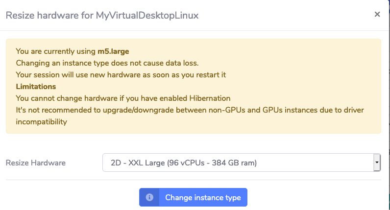

Hardware upgrade/downgrade are instant. Your desktop will use the updated config as soon as you restart it.


## Terminate your desktop

To terminate your desktop, click the "Kill" button from the menu bar.


You will be prompted for a confirmation message. Terminate a session may cause data loss if you are using ephemeral storage, so make sure to have uploaded all your data back to SOCA filesystem first.

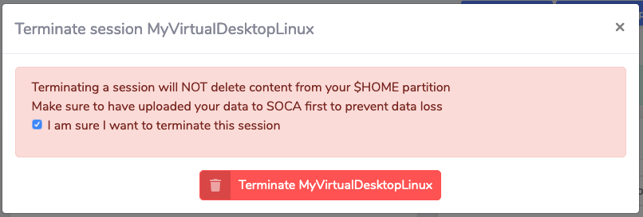
       
## (Windows only) Retrieve local admin password

As of today, Windows desktops are not configured to OpenLDAP, meaning you will use a local Windows account unique to each session. To retrieve the password for the local Administrator account, click "Get Password" icon.


This will open a new window where you can retrieve the password.

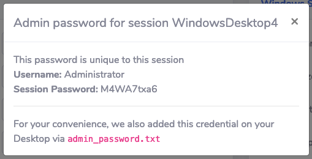

## Create custom Windows/Linux images

SOCA images are Windows or Linux desktops with pre-installed applications. [Refer to this page to learn more about images management](../../web-interface/create-virtual-desktops-images/)

## How idle time is calculated?

When you have enabled `DCV_LINUX_HIBERNATE_IDLE_SESSION`, `DCV_LINUX_STOP_IDLE_SESSION`, `DCV_WINDOWS_HIBERNATE_IDLE_SESSION` or `DCV_WINDOWS_STOP_IDLE_SESSION` configured, SOCA will automatically try to hibernate/stop your idle instance if they are outside of regular schedule hours.

Idle time is calculated based on:

- Last time the user accessed the virtual desktop
- Current CPUs usage.

Session will only be stopped/hibernated if current CPUs is below a threshold configured via `DCV_IDLE_CPU_THRESHOLD` (default to 15%). This setting avoid desktop being stopped/hibernated while compute intensive tasks are still running on, even if the user did not access the desktop for a while.
 


## Common configuration

```
#  General
TIMEZONE = "UTC"  # Change to match your local timezone if needed. See https://en.wikipedia.org/wiki/List_of_tz_database_time_zones for all TZ

DCV_FORCE_INSTANCE_HIBERNATE_SUPPORT = False  # If True, users can only provision instances that support hibernation
DCV_TOKEN_SYMMETRIC_KEY = os.environ["SOCA_DCV_TOKEN_SYMMETRIC_KEY"]  # used to encrypt/decrypt and validate DCV session auth
DCV_RESTRICTED_INSTANCE_TYPE = ['metal', 'nano', 'micro', 'p3', 'p2']  # This instance type won't be visible on the dropdown menu
DCV_IDLE_CPU_THRESHOLD = 15  # SOCA will NOT hibernate/stop an instance if current CPU usage % is over this value
ALLOW_DOWNLOAD_FROM_PORTAL = True  # Give user ability to download files from the web portal

# DCV Linux
DCV_LINUX_SESSION_COUNT = 4
DCV_LINUX_ALLOW_INSTANCE_CHANGE = True  # Allow user to change their instance type if their DCV session is stopped
DCV_LINUX_HIBERNATE_IDLE_SESSION = 1  # In hours. Windows DCV sessions will be hibernated to save cost if there is no active connection within the time specified. 0 to disable
DCV_LINUX_STOP_IDLE_SESSION = 1  # In hours. Windows DCV sessions will be stopped to save cost if there is no active connection within the time specified. 0 to disable
DCV_LINUX_TERMINATE_STOPPED_SESSION = 0  # In hours. Stopped Windows DCV will be permanently terminated if user won't restart it within the time specified. 0 to disable

# DCV Windows
DCV_WINDOWS_SESSION_COUNT = 4
DCV_WINDOWS_ALLOW_INSTANCE_CHANGE = True  # Allow user to change their instance type if their DCV session is stopped
DCV_WINDOWS_HIBERNATE_IDLE_SESSION = 1  # In hours. Windows DCV sessions will be hibernated to save cost if there is no active connection within the time specified. 0 to disable
DCV_WINDOWS_STOP_IDLE_SESSION = 1  # In hours. Windows DCV sessions will be stopped to save cost if there is no active connection within the time specified. 0 to disable
DCV_WINDOWS_TERMINATE_STOPPED_SESSION = 0  # In hours. Stopped Windows DCV will be permanently terminated if user won't restart it within the time specified. 0 to disable
DCV_WINDOWS_AUTOLOGON = True  # enable or disable autologon. If disabled user will have to manually input Windows password
 DCV_WINDOWS_AMI = {"graphics": {"us-east-1": "ami-035a352d4d53371dc",
                                   ....
                                    "ap-south-1": "ami-09c1d03de366041a4"},
                       "non-graphics": {"us-east-1": "ami-021660b17250fbc9b",
                                        ....
                                        "ap-south-1": "ami-08e852f6df553818a"}}
```