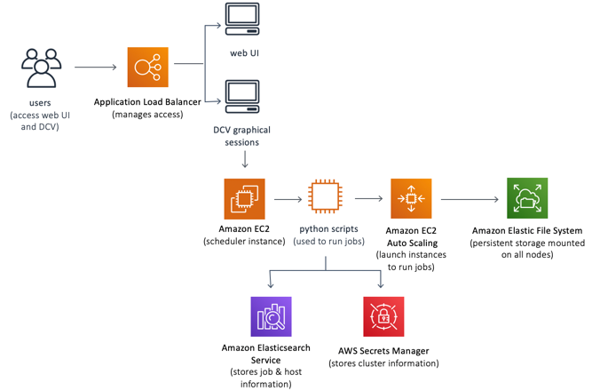

# Synopsys Physical Verification with ICV Tutorial Overview

## Launch a turnkey scale-out compute environment in minutes on AWS

The elasticity of the cloud puts virtually unlimited compute capacity at your fingertips, available within minutes. This can enable companies to quickly scale up in ways they couldn't before, which helps them get results faster. 

In this workshop, you will login to a pre-deployed cluster based on [Scale-Out Computing on AWS reference implementation](https://aws.amazon.com/solutions/scale-out-computing-on-aws/), a solution vetted by AWS Solutions Architects that provides a full-stack, dynamic computing environment that includes a web UI, a workload manager, remote desktops, directory services, analytics dashboards, and budget management.

!!! note
    This tutorial assumes familiarity with the Linux command line.

## Lab environment at a glance

At its core, this solution implements a scheduler using **Amazon Elastic Compute Cloud (Amazon EC2)** instance, which leverages **AWS CloudFormation** and **Amazon EC2 Auto Scaling** to automatically provision the resources necessary to execute cluster user tasks such as scale-out compute jobs and remote visualization sessions.

The solution also deploys **Amazon Elastic File System (Amazon EFS)** for persistent storage; **AWS Lambda** functions to verify the required prerequisites and create a default signed certificate for an **Application Load Balancer (ALB)** to manage access to **Desktop Cloud Visualization (DCV)** workstation sessions; an **Amazon Elasticsearch Service (Amazon ES)** cluster to store job and host metrics; and **AWS Secrets Manager** to store the solution configuration files. The solution also leverages **AWS Identity and Access Management (IAM)** roles to enforce least privileged access.

Due to time limitations for this tutorial session, you will login to a pre-deployed cluster that has been configured to have the following items:

* Synopsys IC Validator (ICV) software pre-installed,
* A license server with valid licenses, and
* Test case to use for ICV

Let's get started. Click the **Next** link in the bottom right corner to move on to the next module.
