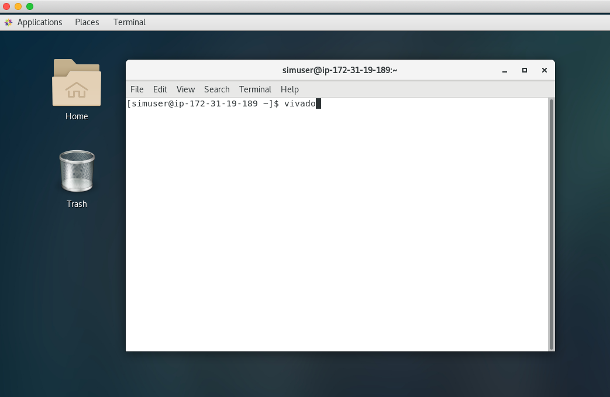
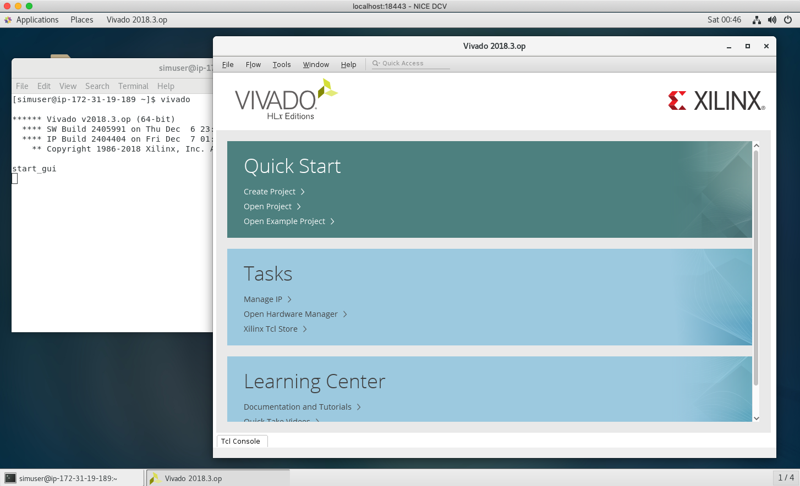
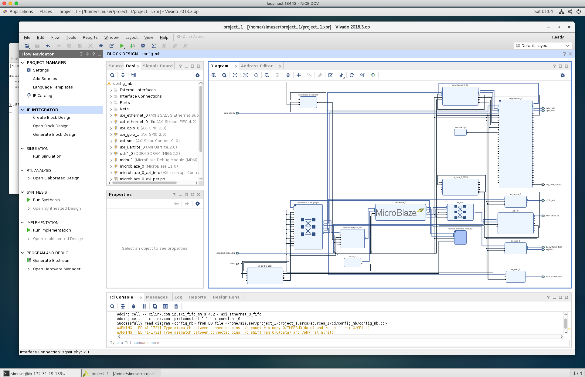

# Lab 4: Launch Vivado GUI

## Launch the Vivado CAD Tool

Now that your remote desktop is set up, you can launch the Vivado Design Suite (included in the AWS FPGA Developer AMI).  The goal with this lab is to evaluate the remote visualization experience using a graphically intensive Computer-Aided Design (CAD) tool.

## Step 1: Log into your session

By now your remote desktop session should be ready and you should see the following under **Your Session #1**:

1. Click **Open Session directly on a browser** to log into the remote desktop session in your new cluster using the username and password you created in the steps above.

    !!! note
        You can also access the session with the NICE DCV native clients, which are available for Mac, Linux, and Windows from https://download.nice-dcv.com

1. To launch Vivado, start a new terminal session by going to **Applications → Favorites → Terminal** in the desktop manager.

1. Type `vivado` at the command prompt and hit enter

    
 
    The Vivado GUI starts and shows the following screen:

    
 
## Step 2: Create a new project

Next, load a sample workload using one of the included example projects:

1. Go to the **Quick Start** section and select **Create Project**.
1. Wait for the wizard to initialize, then on the "Create a New Vivado Project" screen, click **Next >**
1. On the "Project Name" screen, change the project location to `/scratch/<username>`, then click **Next >**
1. On the "Project Type" screen, select **Example Project** , then click **Next >**
1. On the "Select Project Template" screen, click **Next >**
1. On the "Default board or part" screen, click **Next >**
1. On the "Select Design Preset" screen, select **Microcontroller** , then click **Next >**
1. On the "New Project Summary" screen, click **Finish**
1. It should run for 15-20 minutes to create the project and include all required design files. You don't have to wait until this step completes and can move to the next lab.
1. Double-click on **Open Block Diagram** under **IP INTEGRATOR** in the left-side navigation panel

    After the design opens you should see an image similar to this:

    
 
    You can now click around the GUI and scroll and pan through the schematics to get a sense of the remote desktop experience.

1. For extra credit, double-click on **Open Synthesized Design** in the navigation panel to see a more complext layout of the design.

You've completed this lab. Click **Next**.
