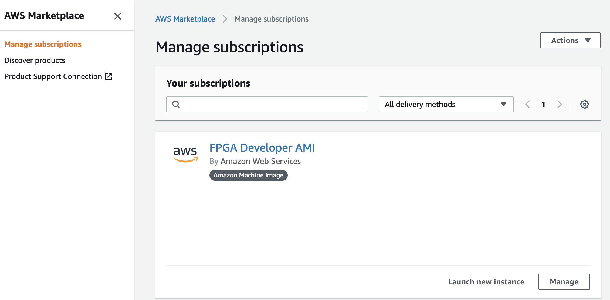
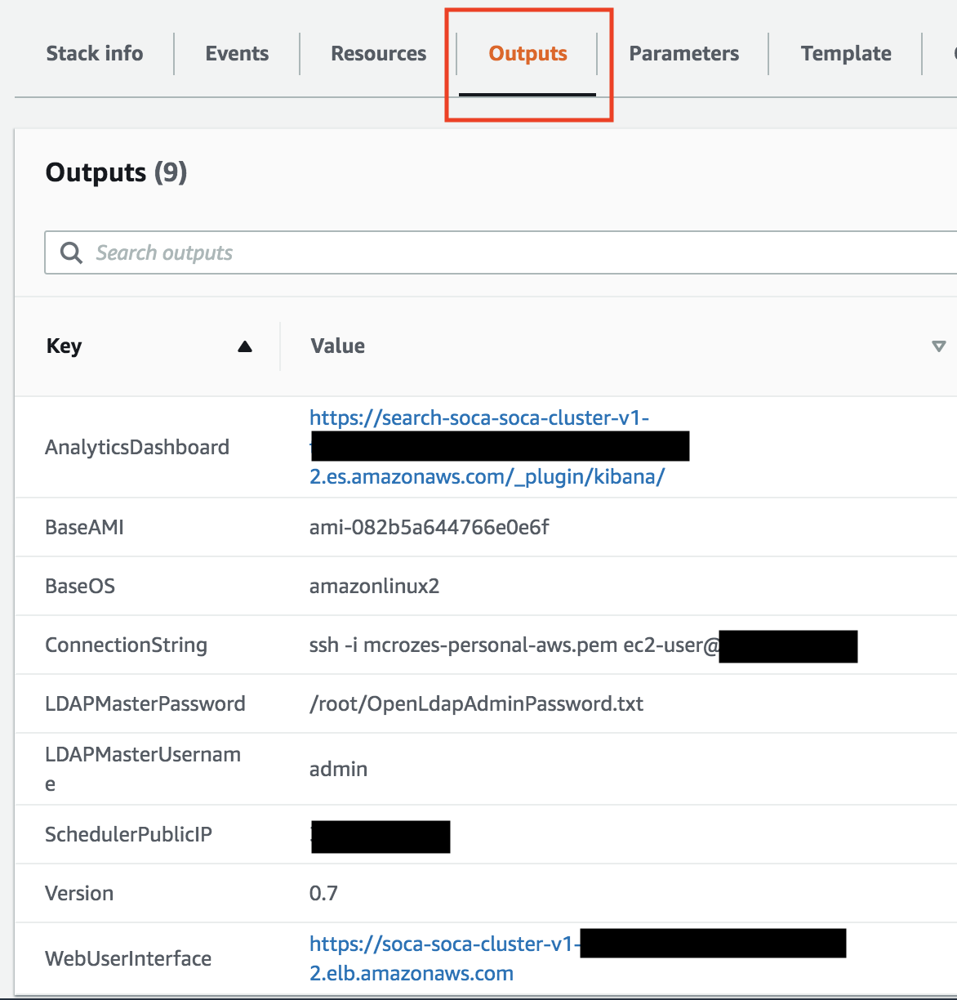
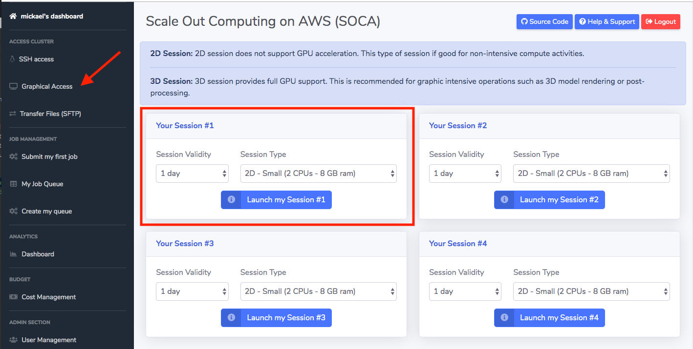

# Lab 3: Launch Remote Desktop Session

The goal of this module is to start a remote desktop session from which you will run applications and submit jobs into the cluster.  You will use the cluster's management console to start and monitor the session.

## Step 1: Subscribe to AWS FPGA Developer AMI

This workshop requires a subscription to the **AWS FPGA Developer AMI** in **AWS Marketplace**. This is the AMI you added to the `/apps/soca/cluster_manager/settings/queue_mapping.yml` file in the previous lab. It will be used to boot the remote desktop instance in AWS and contains software required later in the workshop.

1. Return to the AWS console for your temporary AWS account.

1. Click [here](https://aws.amazon.com/marketplace/pp/B06VVYBLZZ) to open the page for the AWS FPGA Developer AMI in AWS Marketplace, and then choose **Continue to Subscribe**.

1. Review the terms and conditions for software usage, and then choose **Accept Terms**.

    When the subscription process is complete, exit out of AWS Marketplace without further action. Do not click **Continue to Configure**; the workshop CloudFormation templates will deploy the AMI for you.

1. Click [here](https://console.aws.amazon.com/marketplace/home/subscriptions?region=us-east-1#/subscriptions) to verify the subscription within the Marketplace dashboard.  You should see the **FPGA Developer AMI** in the list of subscriptions.

    

## Step 2: Log into web UI

1. Select the root stack named "mod-xxxxxxxx" again, and click **Outputs**.

    

1. The **Outputs** tab provides various bits of information about the provisioned environment. Click on the link to the right of **WebUserInterface** to log into the Web UI

    

    !!! note 
        Your web browser will warn you about a certificate problem with the site.  To open the webpage, you must authorize the browser to trust the self-signed security certificate.  In a production deployment, you would upload a Server Certificate to the Elastic Load Balancer endpoint.

1. Log in using the web UI using the following credentials:

    username: admin

    password: passw0rd (use a zero instead of 'o')

## Step 3: Launch remote desktop server

Follow these instructions to start a full remote desktop experience in your new cluster:

1. Click **Graphical Access** on the left sidebar.

    

1. Select  **1 day** in the **Session Validity** popup menu.

1. Choose **2D - Medium (8 vCPUs - 32GB ram)** in the **Session Type** popup menu.

1. Click **Launch my Session #1**

After you click **Launch my session**, a new job is submitted into the queue that will instruct AWS to provision a server with 8 vCPUs and 32GB of memory and install all desktop required packages including Gnome. 

You will see a message asking you to wait up to 20 minutes before being able to access your remote desktop, but it should take around 10 minutes to deploy the remote desktop server.

!!! note
    You can monitor the deployment of the remote desktop server by observing the status of the CloudFormation stack with a name ending in `job-0`.  If after 5 minutes the status of the stack is not `CREATE_COMPLETE`, please raise your hand for assistance.

Let's move on to the next step while we wait for the desktop instance to launch.  Click **Next**.
